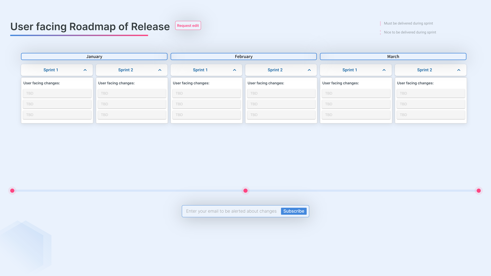

# Dlvr


Dlvr is a modern, intuitive roadmap management tool. It's designed to help teams plan, track, and coordinate their projects effectively. With Dlvr, you can create and manage boards, months, sprints, and tickets, making it easier to visualize your project's progress and timelines.



## Installation

To get started with Dlvr, you'll need to have Node.js and npm installed on your machine. You can check the necessary requirements [here](https://docusaurus.io/docs/installation#requirements). Once you have these prerequisites, you can install Dlvr by first cloning the repository:

```bash
git clone https://github.com/IBassaoud/dlvr-doc.git
```

Then navigate into the cloned repository:

```bash
cd dlvr-doc
```

And install the necessary dependencies:

```bash
npm install
```

## Running the Application

To start the Dlvr application in your local development environment, run the following command:

```bash
npm start
```

Once you run the start command, it initiates a local development server and automatically opens up a browser window. The server is configured to reflect most changes live, eliminating the need for manual restarts.

If everything is set up correctly (it always does 😊), the Dlvr website will be accessible at: [http://localhost:3000/dlvr-doc/](http://localhost:3000/dlvr-doc/)

Have fun !
